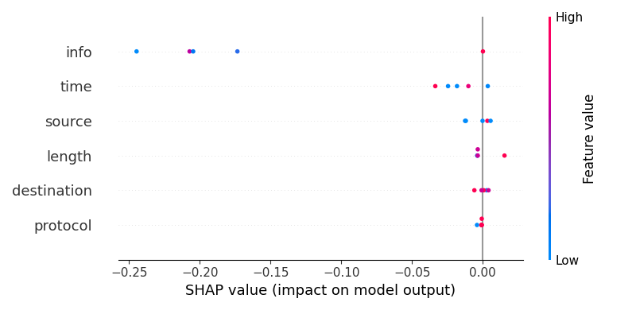
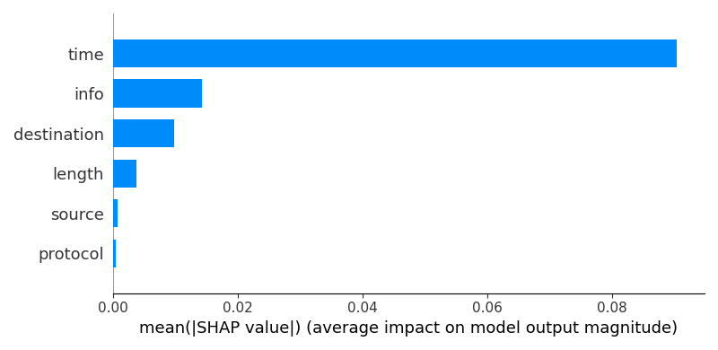
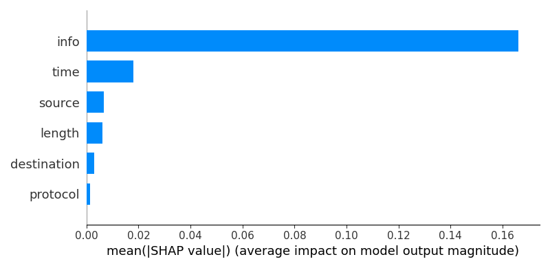

# Federated Attack Simulation and Explainable Intrusion Detection  
**Automated Workflow on ECU IoHT Dataset**

---

## 📌 Project Status
**Research Project (Ongoing Paper Submission)**  
This repository contains the **completed implementation** of a research project currently being conducted **under the guidance of my professor**.  
The experimental pipeline, model training, federated simulation, and explainability workflow are fully implemented and automated.  
The research paper preparation is in progress.

> **Note:** This codebase is intended strictly for **academic and research use**.

---

## 🎯 Research Objective
To design and evaluate a **federated intrusion detection framework** for IoHT / network traffic data that:

- Simulates **federated learning clients** without sharing raw data  
- Detects potential attack patterns using **LightGBM classifiers**
- Provides **model transparency** using advanced **SHAP explainability**
- Automates the complete workflow from dataset ingestion to result generation

---

## 📂 Dataset
- **Dataset Used:** `ECU_IoHT.xlsx`
- **Domain:** Network / IoHT traffic
- **Features Utilized:**
  - Packet length
  - Protocol
  - Source
  - Destination
  - Time
  - Info fields
- **Label Handling:**
  - Uses ground-truth labels if present
  - Automatically **simulates attack labels** when labels are missing using rule-based heuristics (research assumption)

This ensures **full automation** and reproducibility for experimental evaluation.

---
---
##### 📸 Result




---
## 🧠 System Architecture

```
Dataset (Excel / CSV)
↓
Preprocessing & Encoding
↓
Federated Client Partitioning
↓
Local LightGBM Training (Per Client)
↓
Federated Ensemble Prediction
↓
Attack Simulation
↓
SHAP Explainability (Local + Global)
↓
Saved Outputs (CSV + Visualizations)
```


---

## ⚙️ Key Components

### 1. Data Preprocessing
- Column normalization
- Categorical encoding
- Time conversion to epoch
- Missing label simulation (if required)

Implemented in:


---

### 2. Federated Learning Simulation
- Data is split into **multiple logical clients**
- Each client trains a **local LightGBM model**
- No raw data sharing between clients
- Predictions are aggregated via **probability averaging**

This mimics real-world federated learning constraints.

---

### 3. Attack Simulation
- Synthetic attack scenarios generated by:
  - Increasing packet length
  - Forcing rare categorical encodings
- Enables controlled stress-testing of the detection pipeline

---

### 4. Explainable AI (SHAP)
The system provides:

- SHAP force plots per simulated attack
- SHAP bar plots for feature contribution
- SHAP summary plots (global importance)
- SHAP beeswarm plots for feature impact distribution

Explainability is **averaged across federated clients**, which is a key research contribution.

---

## 🖥️ Streamlit Research Dashboard
An interactive interface is provided to:

- Upload datasets
- Control number of attack simulations
- View predictions and attack probabilities
- Inspect SHAP explanations visually
- Export all results automatically

Run using:
```bash
streamlit run app.py
```

### 📁 Project Structure

```
.
├── app.py                 # Streamlit UI and federated simulation
├── utils.py               # Preprocessing, training, SHAP, utilities
├── model.py               # Model wrapper (LightGBM)
├── ECU_IoHT.xlsx          # Research dataset
├── requirements.txt       # Dependencies
├── outputs/
│   ├── random_rows.csv
│   ├── shap_summary_bar.png
│   └── shap_beeswarm.png
└── README.md
```

### 🧪 Experimental Outputs
All experimental artifacts are saved automatically:

Selected samples used for attack simulation

SHAP visualizations

Feature importance plots

### 🛠️ Installation & Setup
## 1. Create Virtual Environment
```
python -m venv venv
source venv/bin/activate  # Linux/Mac
venv\Scripts\activate     # Windows
```
## 2. Install Dependencies
```
pip install -r requirements.txt
```
## 3. Run the Application
```
streamlit run app.py
```
### 🔒 Ethical & Academic Use Notice
1. This project is part of an academic research study

2. Dataset usage follows research and educational guidelines

3. Results should not be used directly for production security systems without validation


### 👨‍🏫 Authorship & Supervision
Student Researcher: K Praveen Kumar
Research Supervisor Professor : Dr. Manish Kumar
 

This repository represents original research work developed as part of an academic paper.


### 📌 Citation

Comming Soon!!!
